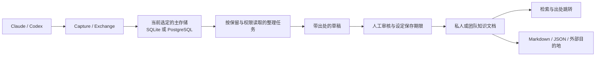

# 从对话证据到团队知识：存储与连接方案

日期：2026-09-23。状态：第二、第三阶段的产品与实现方案，尚未声称已接入其他数据库或知识服务。
当前先执行[第一阶段稳定版计划](2026-09-23-first-public-stability.md)。

## 要交付的能力

团队应能回答“这个故障以前怎么解决”“为什么改了这项配置”“方案的依据是哪几轮对话”，
并把经过审核的结论保存在团队知识库中。使用者可从结论跳回有权限查看的原始 Turn / Exchange。
记录一次 HTTP 请求、存一份对话、生成一篇知识文档是三个不同结果。

首个可验收流程：用户选择有正文的 Conversation，或为获准共享的团队来源开启自动收录 →
Runtime 在后台整理一个“问题、结论、过程、适用范围”候选草稿并引用确切证据 →
人工编辑、选择私人或团队 Collection、设保存期限 → 发布 → 检索、回看出处、导出
Markdown。自动生成只能建议草稿；发布和跨人共享需要显式操作。自动收录由来源所属
Runtime User 授权，只对新完成且按策略保留正文的 Conversation 建立草稿，支持关闭。
后续可以从多个 Conversation 汇成故障复盘或决策记录，保留各来源和修订。

## 两种独立的“可切换”

| 用户所选 | 管理什么 | 首个实际支持目标 |
| --- | --- | --- |
| **运行时主存储** | Capture、策略修订、账号引用、证据、知识文档及删除事务的唯一权威 | 本地默认 SQLite；为原生/容器 Server 增加 PostgreSQL 作为第二种完整实现 |
| **知识目的地** | 已发布文档或经允许的索引副本发往哪里 | 下载 Markdown / JSON；有具体需求后接一个外部知识服务或受控 Webhook |

主存储在 Runtime 启动时选定；切换既有数据须停止写入、备份、迁移、验证再重启。
外部目的地的故障不影响 Agent 请求、证据落库或本地阅读。目的地不反向决定原始证据的
授权、策略发布或账号凭据。App 维持本地 SQLite 的零配置启动；团队可运行
PostgreSQL 支撑的 Runtime Server，Web 与 CLI 接入同一个 Runtime。现有控制接口保持一致。

## 推荐的引擎

**第二种主存储推荐 PostgreSQL。** 对团队 Server，它提供成熟的事务、JSONB 和全文索引；
向量检索确有需求时可另行评估 pgvector，而不用让核心记录依赖向量扩展。
PostgreSQL 使用宽松的 [PostgreSQL License](https://www.postgresql.org/about/licence/)；
其 [JSONB 索引](https://www.postgresql.org/docs/current/datatype-json.html)、
[全文检索](https://www.postgresql.org/docs/current/textsearch.html) 和
[行级策略](https://www.postgresql.org/docs/current/sql-createpolicy.html) 是可用能力，
但 ViberMate 的权限仍须由 Runtime 对每个读取和导出执行；数据库特性不会自动替我们迁移
现有授权规则。中文与代码混合语料的检索质量必须实测，
[pg_trgm](https://www.postgresql.org/docs/current/pgtrgm.html) 是候选而非自动的中文分词答案。
[pgvector](https://github.com/pgvector/pgvector) 属可选扩展，部署者未安装时基础能力仍应可用。

SQLite 继续负责本地场景；其 [FTS5](https://www.sqlite.org/fts5.html) 可作为第一版
关键词检索候选，但要先核对本项目所用驱动的构建能力及中英代码混合检索效果。
**SurrealDB 仍可作为以后验证的知识关系或检索目的地**；其文档、图和向量能力不负责把
对话自动变成可信结论。[已有版本、Go 嵌入、许可和运维核对](../research/2026-09-23-surrealdb-evaluation.md)
说明它目前不适合作为“只需改连接串”的第二主存储。

当前 `productruntime.Start` 在
[buildStorage](../../internal/productruntime/builders.go) 直接打开 SQLite，
[Store](../../internal/runtimepersistence/store.go) 持有多种仓储以及跨表生命周期；
[数据位置](../../internal/productruntime/options.go) 和 App 迁移流程也明确指向 `runtime.db`。
因此目前没有可切换数据库的产品能力，现有“Repository 接口”并不等于 PostgreSQL 已可替代。
第二实现要覆盖完整行为后才能显示该选项，不能提供只存对话但丢失策略或证据的半成品。

## 兼容性与迁移门槛

- 两种主存储使用同一业务读取和控制行为：Capture / Environment 修订、账号关联、
  原始和语义证据、用量、团队成员权限、保留与删除。Raw HTTP 的字节和摘要不能经 JSONB
  重新编码；应保存确切 bytes，知识文档只引用经允许的语义内容。
- 策略发布的 CAS、提交响应不明时的核对、账号凭据 epoch、证据批量写入及
  [整张 Capture 证据图的事务删除](../../internal/runtimepersistence/capture_deletion.go)
  都需要 PostgreSQL 适配后的共同验收。不能只在若干 `Repository` 上跑 CRUD 测试。
- 本地 App 数据目录还包含 CA、配置与可能的 WAL；Keychain 凭据不会自动跨机器迁移。
  迁移需在停写状态记录清单、校验数量与摘要、抽样回放读写、失败保留原数据。
  切到远程库后数据库不可用应报告故障，不能静默另建一个空 SQLite 分叉。
- 先在原生/容器 Server 上验收 PostgreSQL，再决定是否让本机 App 直接连接远程主存储。
  浏览器、Agent 和脚本不能持有数据库管理凭据。

具体代码的 seam 是 **运行时启动时选定的一组持久化能力**，不是每次请求选择数据库。
现有领域接口（例如 `activity.Repository` 与 `exchangecontent.Repository`）可继续由两个
适配器满足。跨仓储原子操作保留为一个深的存储 Module，不能拆成各自成功的双写。
到第二个实现真能跑通时，再抽出最小的 Runtime 存储接口和启动配置；不先造可加载任意
数据库的插件框架。两套实现共用控制面契约和行为测试，各自保留适合其引擎的 SQL、迁移与备份。

## 团队知识的权限与生命周期

1. **来源。** 只读当前策略实际保留的语义消息和工具结果；`metadata_only` 或 `off`
   不能凭空生成正文。自动草稿标出来源 Capture、Conversation、Turn / Exchange 和时间，
   不把模型推断、时间相近或相似提示写成已证实的因果关系。
2. **Collection。** 私人或明确加入的团队 Collection 使用独立授权。现有本地 Workspace ID
   是设备上的证据，不能据相同目录名把不同成员的会话自动合并为团队项目。团队收录
   和成员可见性必须是来源所属用户的显式决定；Owner 能看运行证据不等于自动把个人
   内容发布给全队。团队 Collection 的草稿队列仅接收获准收录的来源。
3. **草稿。** 未发布草稿与来源正文使用相同或更短的保存期限。可选模型辅助整理需要用户
   选择账号/模型和发送范围；默认不将团队对话发往新的第三方。失败保持原始证据可读。
4. **发布。** 根据用户已确定的规则，审核发布的 Knowledge Document 选择独立保存期限，
   可以长于来源；保存时明确展示会留下哪些衍生文字以及访问人群。发布修订和审核人
   可追溯，之后的编辑产生新修订。权限撤销会立即收回访问，不等保存期限届满。
5. **删除。** 删除 Capture 时列出引用它的已发布文档：自动草稿和索引副本同步清理；
   独立保存的已发布文档仍按其授权与期限存在，出处显示“原始证据已不可用”。用户可
   同时选择撤回/删除相关文档。删除整个知识 Collection 或撤销共享应使搜索、导出和
   外部目的地都遵守相同结果；对无法立即完成的外部撤回显示明确状态。
6. **检索。** 先判当前操作者能否访问 Collection 和文档，再返回标题、摘要、片段与
   citation；无权限的命中不能通过搜索计数或标题侧漏。语义向量也可能包含敏感信息，
   按相同权限和删除规则处理。

## 分段交付

1. **第二阶段：第二种主存储。** 完成 PostgreSQL 的完整运行时存储适配与共同契约测试；
   原生、容器 Server 验收，再提供停止运行后的 SQLite ↔ PostgreSQL 迁移与回退。App 默认
   本地启动体验不增加数据库配置。
2. **第三阶段：知识文档最小闭环。** 在当前选定的主存储上实现手动选择及可关闭的团队自动收录、
   带出处的候选草稿、编辑审核、私人/团队发布、独立保存期限、准确检索和 Markdown
   导出。用真实 App/Web 用户路径验证“找回一条可用结论”，而不是只测写入成功；覆盖
   成员隔离、正文未记录、来源过期和任务失败后的重试。
3. **第三阶段：外部连接。** 以 Markdown/JSON 导出开始，根据实际团队目标选择一个具体的外部
   知识服务或受控 Webhook；出站只发审核发布的文档，记录目的地、修订、状态和撤回。
4. **后续增强。** 有实际问题集再加模型生成建议、语义检索、关系查询和可选索引
   引擎。衡量文档被复用的比例、可追溯性、错误率和管理成本；只增加真实需求推动的适配器。

上述阶段按顺序交付，统一遵守旧功能不变的验收：默认部署不增加服务；未开启知识功能
时现有请求、OAuth、策略、捕获、保留与 UI 路径行为不变；跨主存储读取/删除结果一致；
迁移失败后仍可在原存储上恢复，且不会出现两份同时可写的“当前数据”。
